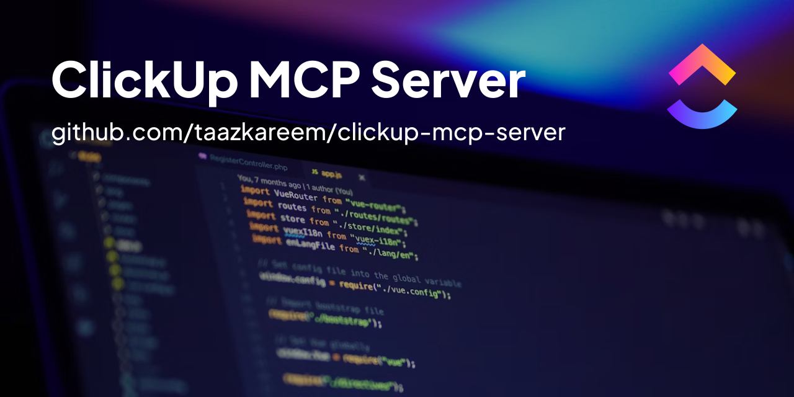

[](https://github.com/TaazKareem/clickup-mcp-server/stargazers)
[](https://github.com/TaazKareem/clickup-mcp-server/graphs/commit-activity)

A Model Context Protocol (MCP) server for integrating ClickUp tasks with AI applications. This server allows AI agents to interact with ClickUp tasks, spaces, lists, and folders through a standardized protocol.

> 🚀 **Status Update:** v0.8.4 is released with security features and compatibility improvements! Added comprehensive opt-in enhanced security features, fixed Gemini compatibility (Issue #79), and resolved priority handling and subtask retrieval issues. See [Release Notes](release-notes.md) for full details.

## Setup

1. Get your credentials:
   - ClickUp API key from [ClickUp Settings](https://app.clickup.com/settings/apps)
   - Team ID from your ClickUp workspace URL
2. Choose either hosted installation (sends webhooks) or NPX installation (downloads to local path and installs dependencies)
3. Use natural language to manage your workspace!

## Smithery Installation (Quick Start)

[](https://smithery.ai/server/@TaazKareem/clickup-mcp-server)

The server is hosted on [Smithery](https://smithery.ai/server/@taazkareem/clickup-mcp-server). There, you can preview the available tools or copy the commands to run on your specific client app.

## NPX Installation

[](https://www.npmjs.com/package/@taazkareem/clickup-mcp-server)
[](https://github.com/TaazKareem/clickup-mcp-server/blob/main/package.json)
[](https://npmcharts.com/compare/@taazkareem/clickup-mcp-server?minimal=true)

Add this entry to your client's MCP settings JSON file:

```json
{
  "mcpServers": {
    "ClickUp": {
      "command": "npx",
      "args": [
        "-y",
        "@taazkareem/clickup-mcp-server@latest"
      ],
      "env": {
        "CLICKUP_API_KEY": "your-api-key",
        "CLICKUP_TEAM_ID": "your-team-id",
        "DOCUMENT_SUPPORT": "true"
      }
    }
  }
}
```

Or use this npx command:

`npx -y @taazkareem/clickup-mcp-server@latest --env CLICKUP_API_KEY=your-api-key --env CLICKUP_TEAM_ID=your-team-id`

**Obs: if you don't pass "DOCUMENT_SUPPORT": "true", the default is false and document support will not be active.**

### Tool Filtering

You can control which tools are available using two complementary environment variables:

#### ENABLED_TOOLS (Recommended)
Use `ENABLED_TOOLS` to specify exactly which tools should be available:
```bash
# Environment variable
export ENABLED_TOOLS="create_task,get_task,update_task,get_workspace_hierarchy"

# Command line argument
--env ENABLED_TOOLS=create_task,get_task,update_task,get_workspace_hierarchy
```

#### DISABLED_TOOLS (Legacy)
Use `DISABLED_TOOLS` to disable specific tools while keeping all others enabled:
```bash
# Environment variable
export DISABLED_TOOLS="delete_task,delete_bulk_tasks"

# Command line argument
--env DISABLED_TOOLS=delete_task,delete_bulk_tasks
```

#### Precedence Rules
- If `ENABLED_TOOLS` is specified, only those tools will be available (takes precedence over `DISABLED_TOOLS`)
- If only `DISABLED_TOOLS` is specified, all tools except those listed will be available
- If neither is specified, all tools are available (default behavior)

**Example:**
```bash
# Only enable task creation and reading tools
npx -y @taazkareem/clickup-mcp-server@latest \
  --env CLICKUP_API_KEY=your-api-key \
  --env CLICKUP_TEAM_ID=your-team-id \
  --env ENABLED_TOOLS=create_task,get_task,get_workspace_hierarchy
```

Please filter tools you don't need if you are having issues with the number of tools or any context limitations.

## Running with HTTP Transport Support

The server supports both modern **HTTP Streamable** transport (MCP Inspector compatible) and legacy **SSE (Server-Sent Events)** transport for backwards compatibility.

```json
{
  "mcpServers": {
    "ClickUp": {
      "command": "npx",
      "args": [
        "-y",
        "@taazkareem/clickup-mcp-server@latest"
      ],
      "env": {
        "CLICKUP_API_KEY": "your-api-key",
        "CLICKUP_TEAM_ID": "your-team-id",
        "ENABLE_SSE": "true",
        "PORT": "3231"
      }
    }
  }
}
```

**Endpoints:**
- **Primary**: `http://127.0.0.1:3231/mcp` (Streamable HTTP)
- **Legacy**: `http://127.0.0.1:3231/sse` (SSE for backwards compatibility)

### Command Line Usage

```bash
npx -y @taazkareem/clickup-mcp-server@latest --env CLICKUP_API_KEY=your-api-key --env CLICKUP_TEAM_ID=your-team-id --env ENABLE_SSE=true --env PORT=3231
```

Available configuration options:

| Option | Description | Default |
| ------ | ----------- | ------- |
| `ENABLED_TOOLS` | Comma-separated list of tools to enable (takes precedence) | All tools |
| `DISABLED_TOOLS` | Comma-separated list of tools to disable | None |
| `ENABLE_SSE` | Enable the HTTP/SSE transport | `false` |
| `PORT` | Port for the HTTP server | `3231` |
| `ENABLE_STDIO` | Enable the STDIO transport | `true` |
| `ENABLE_SECURITY_FEATURES` | Enable security headers and logging | `false` |
| `ENABLE_HTTPS` | Enable HTTPS/TLS encryption | `false` |
| `ENABLE_ORIGIN_VALIDATION` | Validate Origin header against whitelist | `false` |
| `ENABLE_RATE_LIMIT` | Enable rate limiting protection | `false` |

### 🔒 Security Features

The server includes optional security enhancements for production deployments. All security features are **opt-in** and **disabled by default** to maintain backwards compatibility.

**Quick security setup:**
```bash
# Generate SSL certificates for HTTPS
./scripts/generate-ssl-cert.sh

# Start with full security
ENABLE_SECURITY_FEATURES=true \
ENABLE_HTTPS=true \
ENABLE_ORIGIN_VALIDATION=true \
ENABLE_RATE_LIMIT=true \
SSL_KEY_PATH=./ssl/server.key \
SSL_CERT_PATH=./ssl/server.crt \
npx @taazkareem/clickup-mcp-server@latest --env CLICKUP_API_KEY=your-key --env CLICKUP_TEAM_ID=your-team --env ENABLE_SSE=true
```

**HTTPS Endpoints:**
- **Primary**: `https://127.0.0.1:3443/mcp` (Streamable HTTPS)
- **Legacy**: `https://127.0.0.1:3443/sse` (SSE HTTPS for backwards compatibility)
- **Health**: `https://127.0.0.1:3443/health` (Health check)

For detailed security configuration, see [Security Features Documentation](docs/security-features.md).

#### n8n Integration

To integrate with n8n:

1. Start the clickup-mcp-server with SSE enabled
2. In n8n, add a new "MCP AI Tool" node
3. Configure the node with:
   - Transport: SSE
   - Server URL: `http://localhost:3231` (or your server address)
   - Tools: Select the ClickUp tools you want to use

#### Example Client

An example SSE client is provided in the `examples` directory. To run it:

```bash
# Start the server with SSE enabled
ENABLE_SSE=true PORT=3231 npx -y @taazkareem/clickup-mcp-server@latest --env CLICKUP_API_KEY=your-api-key --env CLICKUP_TEAM_ID=your-team-id

# In another terminal, run the example client
cd examples
npm install
npm run sse-client
```

## Features

| 📝 Task Management                                                                                                                                                                                                                                                   | 🏷️ Tag Management                                                                                                                                                                                                                                                        |
| -------------------------------------------------------------------------------------------------------------------------------------------------------------------------------------------------------------------------------------------------------------------- | -------------------------------------------------------------------------------------------------------------------------------------------------------------------------------------------------------------------------------------------------------------------------- |
| • Create, update, and delete tasks<br>• Move and duplicate tasks anywhere<br>• Support for single and bulk operations<br>• Set start/due dates with natural language<br>• Create and manage subtasks<br>• Add comments and attachments | • Create, update, and delete space tags<br>• Add and remove tags from tasks<br>• Use natural language color commands<br>• Automatic contrasting foreground colors<br>• View all space tags<br>• Tag-based task organization across workspace |
| ⏱️ **Time Tracking**                                                                                                                                                                                                                                          | 🌳 **Workspace Organization**                                                                                                                                                                                                                                         |
| • View time entries for tasks<br>• Start/stop time tracking on tasks<br>• Add manual time entries<br>• Delete time entries<br>• View currently running timer<br>• Track billable and non-billable time                                 | • Navigate spaces, folders, and lists<br>• Create and manage folders<br>• Organize lists within spaces<br>• Create lists in folders<br>• View workspace hierarchy<br>• Efficient path navigation                                             |
| 📄 **Document Management**                                                                                                                                                                                                                                      | 👥 **Member Management**                                                                                                                                                                                                                                             |
| • Document Listing through all workspace<br>• Document Page listing<br>• Document Page Details<br>• Document Creation<br>• Document page update (append & prepend)                                                                       | • Find workspace members by name or email<br>• Resolve assignees for tasks<br>• View member details and permissions<br>• Assign tasks to users during creation and updates<br>• Support for user IDs, emails, or usernames<br>• Team-wide user management                            |
| ⚡ **Integration Features**                                                                                                                                                                                                                                      | 🏗️ **Architecture & Performance**                                                                                                                                                                                                                                        |
| • Global name or ID-based lookups<br>• Case-insensitive matching<br>• Markdown formatting support<br>• Built-in rate limiting<br>• Error handling and validation<br>• Comprehensive API coverage                                             | • **70% codebase reduction** for improved performance<br>• **Unified architecture** across all transport types<br>• **Zero code duplication**<br>• **HTTP Streamable transport** (MCP Inspector compatible)<br>• **Legacy SSE support** for backwards compatibility |

## Available Tools (36 Total)

| Tool                                                               | Description                     | Required Parameters                                                                                                          |
| ------------------------------------------------------------------ | ------------------------------- | ---------------------------------------------------------------------------------------------------------------------------- |
| [get_workspace_hierarchy](docs/user-guide.md#workspace-navigation) | Get workspace structure         | None                                                                                                                         |
| [create_task](docs/user-guide.md#task-management)                  | Create a task                   | `name`, (`listId`/`listName`)                                                                                          |
| [create_bulk_tasks](docs/user-guide.md#task-management)            | Create multiple tasks           | `tasks[]`                                                                                                                  |
| [update_task](docs/user-guide.md#task-management)                  | Modify task                     | `taskId`/`taskName`                                                                                                      |
| [update_bulk_tasks](docs/user-guide.md#task-management)            | Update multiple tasks           | `tasks[]` with IDs or names                                                                                                |
| [get_tasks](docs/user-guide.md#task-management)                    | Get tasks from list             | `listId`/`listName`                                                                                                      |
| [get_task](docs/user-guide.md#task-management)                     | Get single task details         | `taskId`/`taskName` (with smart disambiguation)                                                                          |
| [get_workspace_tasks](docs/user-guide.md#task-management)          | Get tasks with filtering        | At least one filter (tags, list_ids, space_ids, etc.)                                                                        |
| [get_task_comments](docs/user-guide.md#task-management)            | Get comments on a task          | `taskId`/`taskName`                                                                                                      |
| [create_task_comment](docs/user-guide.md#task-management)          | Add a comment to a task         | `commentText`, (`taskId`/(`taskName`+`listName`))                                                                    |
| [attach_task_file](docs/user-guide.md#task-management)             | Attach file to a task           | `taskId`/`taskName`, (`file_data` or `file_url`)                                                                     |
| [delete_task](docs/user-guide.md#task-management)                  | Remove task                     | `taskId`/`taskName`                                                                                                      |
| [delete_bulk_tasks](docs/user-guide.md#task-management)            | Remove multiple tasks           | `tasks[]` with IDs or names                                                                                                |
| [move_task](docs/user-guide.md#task-management)                    | Move task                       | `taskId`/`taskName`, `listId`/`listName`                                                                             |
| [move_bulk_tasks](docs/user-guide.md#task-management)              | Move multiple tasks             | `tasks[]` with IDs or names, target list                                                                                   |
| [duplicate_task](docs/user-guide.md#task-management)               | Copy task                       | `taskId`/`taskName`, `listId`/`listName`                                                                             |
| [create_list](docs/user-guide.md#list-management)                  | Create list in space            | `name`, `spaceId`/`spaceName`                                                                                          |
| [create_folder](docs/user-guide.md#folder-management)              | Create folder                   | `name`, `spaceId`/`spaceName`                                                                                          |
| [create_list_in_folder](docs/user-guide.md#list-management)        | Create list in folder           | `name`, `folderId`/`folderName`                                                                                        |
| [get_folder](docs/user-guide.md#folder-management)                 | Get folder details              | `folderId`/`folderName`                                                                                                  |
| [update_folder](docs/user-guide.md#folder-management)              | Update folder properties        | `folderId`/`folderName`                                                                                                  |
| [delete_folder](docs/user-guide.md#folder-management)              | Delete folder                   | `folderId`/`folderName`                                                                                                  |
| [get_list](docs/user-guide.md#list-management)                     | Get list details                | `listId`/`listName`                                                                                                      |
| [update_list](docs/user-guide.md#list-management)                  | Update list properties          | `listId`/`listName`                                                                                                      |
| [delete_list](docs/user-guide.md#list-management)                  | Delete list                     | `listId`/`listName`                                                                                                      |
| [get_space_tags](docs/user-guide.md#tag-management)                | Get space tags                  | `spaceId`/`spaceName`                                                                                                    |
| [create_space_tag](docs/user-guide.md#tag-management)              | Create tag                      | `tagName`, `spaceId`/`spaceName`                                                                                       |
| [update_space_tag](docs/user-guide.md#tag-management)              | Update tag                      | `tagName`, `spaceId`/`spaceName`                                                                                       |
| [delete_space_tag](docs/user-guide.md#tag-management)              | Delete tag                      | `tagName`, `spaceId`/`spaceName`                                                                                       |
| [add_tag_to_task](docs/user-guide.md#tag-management)               | Add tag to task                 | `tagName`, `taskId`/(`taskName`+`listName`)                                                                          |
| [remove_tag_from_task](docs/user-guide.md#tag-management)          | Remove tag from task            | `tagName`, `taskId`/(`taskName`+`listName`)                                                                          |
| [get_task_time_entries](docs/user-guide.md#time-tracking)          | Get time entries for a task     | `taskId`/`taskName`                                                                                                      |
| [start_time_tracking](docs/user-guide.md#time-tracking)            | Start time tracking on a task   | `taskId`/`taskName`                                                                                                      |
| [stop_time_tracking](docs/user-guide.md#time-tracking)             | Stop current time tracking      | None                                                                                                                         |
| [add_time_entry](docs/user-guide.md#time-tracking)                 | Add manual time entry to a task | `taskId`/`taskName`, `start`, `duration`                                                                             |
| [delete_time_entry](docs/user-guide.md#time-tracking)              | Delete a time entry             | `timeEntryId`                                                                                                              |
| [get_current_time_entry](docs/user-guide.md#time-tracking)         | Get currently running timer     | None                                                                                                                         |
| [get_workspace_members](docs/user-guide.md#member-management)      | Get all workspace members       | None                                                                                                                         |
| [find_member_by_name](docs/user-guide.md#member-management)        | Find member by name or email    | `nameOrEmail`                                                                                                               |
| [resolve_assignees](docs/user-guide.md#member-management)          | Resolve member names to IDs     | `assignees[]`                                                                                                              |
| [create_document](docs/user-guide.md#document-management)          | Create a document               | `workspaceId`, `name`, `parentId`/`parentType`, `visibility`, `create_pages`                                     |
| [get_document](docs/user-guide.md#document-management)             | Get a document                  | `workspaceId`/`documentId`                                                                                               |
| [list_documents](docs/user-guide.md#document-management)           | List documents                  | `workspaceId`, `documentId`/`creator`/`deleted`/`archived`/`parent_id`/`parent_type`/`limit`/`next_cursor` |
| [list_document_pages](docs/user-guide.md#document-management)      | List document pages             | `documentId`/`documentName`                                                                                              |
| [get_document_pages](docs/user-guide.md#document-management)       | Get document pages              | `documentId`/`documentName`, `pageIds`                                                                                 |
| [create_document_pages](docs/user-guide.md#document-management)    | Create a document page          | `workspaceId`/`documentId`, `parent_page_id`/`name`/`sub_title`,`content`/`content_format`                     |
| [update_document_page](docs/user-guide.md#document-management)     | Update a document page          | `workspaceId`/`documentId`, `name`/`sub_title`,`content`/`content_edit_mode`/`content_format`                  |

See [full documentation](docs/user-guide.md) for optional parameters and advanced usage.

## Member Management Tools

When creating or updating tasks, you can assign users using the `assignees` parameter. The parameter accepts an array of user IDs, emails, or usernames:

**Creating tasks with assignees:**
```json
{
  "name": "New Task",
  "description": "This is a new task.",
  "assignees": ["jdoe@example.com", "Jane Smith"]  // Emails, usernames, or user IDs
}
```

**Updating task assignees:**
```json
{
  "taskId": "abc123",
  "assignees": ["newuser@example.com"]  // Replace existing assignees
}
```

The member management tools help resolve user references when needed.

## Prompts

Not yet implemented and not supported by all client apps. Request a feature for a Prompt implementation that would be most beneficial for your workflow (without it being too specific). Examples:

| Prompt                                             | Purpose                   | Features                                  |
| -------------------------------------------------- | ------------------------- | ----------------------------------------- |
| [summarize_tasks](docs/user-guide.md#prompts)      | Task overview             | Status summary, priorities, relationships |
| [analyze_priorities](docs/user-guide.md#prompts)   | Priority optimization     | Distribution analysis, sequencing         |
| [generate_description](docs/user-guide.md#prompts) | Task description creation | Objectives, criteria, dependencies        |

## Error Handling

The server provides clear error messages for:

- Missing required parameters
- Invalid IDs or names
- Items not found
- Permission issues
- API errors
- Rate limiting

The `LOG_LEVEL` environment variable can be specified to control the verbosity of server logs. Valid values are `trace`, `debug`, `info`, `warn`, and `error` (default).
This can be also be specified on the command line as, e.g. `--env LOG_LEVEL=info`.

## Support the Developer

When using this server, you may occasionally see a small sponsor message with a link to this repository included in tool responses. I hope you can support the project!
If you find this project useful, please consider supporting:

[](https://github.com/sponsors/TaazKareem)

<a href="https://buymeacoffee.com/taazkareem">
  
</a>

## Acknowledgements

Special thanks to [ClickUp](https://clickup.com) for their excellent API and services that make this integration possible.

## Contributing

Contributions are welcome! Please read our [Contributing Guide](CONTRIBUTING.md) for details.

## License

[](https://opensource.org/licenses/MIT)

This project is licensed under the MIT License - see the [LICENSE](LICENSE) file for details.

## Disclaimer

This software makes use of third-party APIs and may reference trademarks
or brands owned by third parties. The use of such APIs or references does not imply
any affiliation with or endorsement by the respective companies. All trademarks and
brand names are the property of their respective owners. This project is an independent
work and is not officially associated with or sponsored by any third-party company mentioned.
