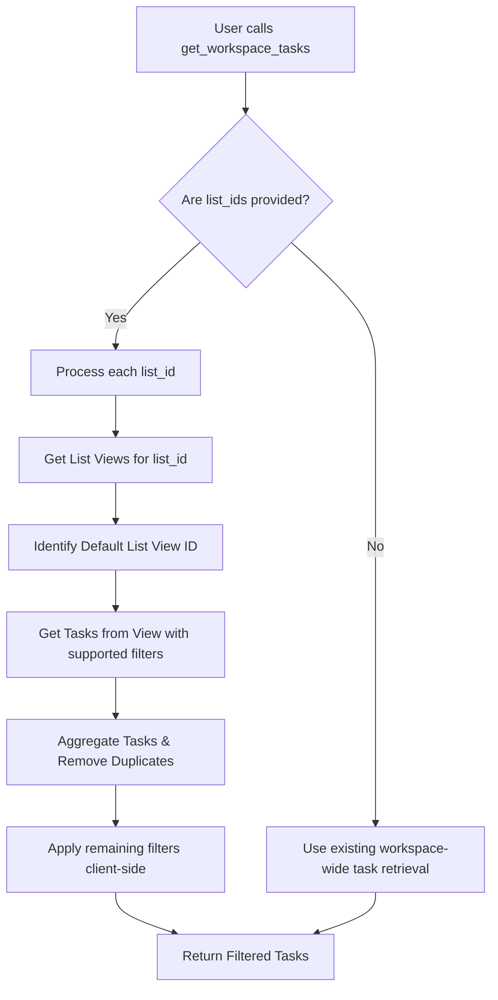

# Plan: Enhance `get_workspace_tasks` for "Tasks in Multiple Lists"

## Objective
Modify the existing `get_workspace_tasks` tool to accurately retrieve tasks associated with specified lists (including tasks added from other lists) by leveraging the ClickUp Views API. This addresses Issue #43.

## High-Level Flow

## Detailed Implementation Steps

### 1. Update `src/tools/task/workspace-operations.ts`
*   **Description Update**: Modify the `description` property of `getWorkspaceTasksTool` to clearly state that when `list_ids` are provided, the tool will now include tasks that are *associated with* (either primary or added to) the specified lists, leveraging ClickUp's "tasks in multiple lists" feature via the Views API.

### 2. Modify `src/services/clickup/task/task-search.ts`
This file will be extended to handle interactions with the ClickUp Views API.

*   **Add `getListViews(listId: string): Promise<string | null>` method**:
    *   **Purpose**: Fetches all views for a given list and identifies the default "List" view ID.
    *   **API Call**: `GET /api/v2/list/{list_id}/view`
    *   **Logic**:
        *   Make an authenticated GET request to the endpoint.
        *   Parse the JSON response.
        *   Identify the default list view by looking for `response.data.required_views.list.id`.
        *   Return the `id` of this view.
        *   Implement robust error handling and return `null` or throw an informative error if the default list view cannot be found.

*   **Add `getTasksFromView(viewId: string, filters: TaskFilters): Promise<ClickUpTask[]>` method**:
    *   **Purpose**: Retrieves tasks from a specific view, applying supported filters.
    *   **API Call**: `GET /api/v2/view/{view_id}/task`
    *   **Logic**:
        *   Map the provided `filters` (e.g., `page`, `custom_task_ids`, `subtasks`, `include_closed`, `statuses`, `assignees`, date filters, `order_by`, `reverse`, `custom_fields`) to the query parameters supported by this endpoint.
        *   Make an authenticated GET request to the endpoint.
        *   Implement pagination: If the response indicates `has_more` tasks, make subsequent API calls to fetch all pages until all tasks are retrieved or a predefined limit is reached.
        *   Return the aggregated list of `ClickUpTask` objects.
        *   Handle errors gracefully.

### 3. Modify `src/tools/task/handlers.ts` (`handleGetWorkspaceTasks`)
This function will implement the core conditional logic for task retrieval.

*   **Import New Methods**: Import `getListViews` and `getTasksFromView` from `taskService`.
*   **Conditional Logic for `list_ids`**:
    *   At the beginning of `handleGetWorkspaceTasks`, add a check: `if (params.list_ids && params.list_ids.length > 0)`.
    *   **Inside the `if` block (View-based retrieval)**:
        *   Initialize `allTasks: ClickUpTask[] = []` and `processedTaskIds = new Set<string>()`.
        *   Create an array of promises for concurrent fetching: `const fetchPromises = params.list_ids.map(async (listId) => { ... });`
        *   For each `listId` in `params.list_ids`:
            *   Call `const viewId = await taskService.getListViews(listId);`.
            *   If `viewId` is found:
                *   Extract filters supported by `/view/{view_id}/task` from `params`. These include: `subtasks`, `statuses`, `assignees`, `date_created_gt`, `date_created_lt`, `date_updated_gt`, `date_updated_lt`, `due_date_gt`, `due_date_lt`, `include_closed`, `archived`, `order_by`, `reverse`, `page`, `custom_fields`.
                *   Call `const tasksFromView = await taskService.getTasksFromView(viewId, supportedFilters);`.
                *   Iterate through `tasksFromView`. For each `task`:
                    *   If `!processedTaskIds.has(task.id)`, add `task` to `allTasks` and `task.id` to `processedTaskIds`.
            *   Add error handling for individual list view/task retrieval failures.
        *   `await Promise.all(fetchPromises);` to execute calls concurrently.
        *   **Client-Side Filtering for Unsupported Filters**:
            *   After aggregating all tasks into `allTasks`, apply any filters from the original `params` that are *not* supported by the `/view/{view_id}/task` endpoint. These include: `tags`, `folder_ids`, `space_ids`.
            *   Example for `tags`: `allTasks = allTasks.filter(task => params.tags.every(tag => task.tags.some(t => t.name === tag)));`
            *   Example for `folder_ids` and `space_ids`: Filter based on `task.folder.id` and `task.space.id` properties.
        *   **Token Limit Handling**: Re-evaluate the `wouldExceedTokenLimit` logic on the `allTasks` array. If the limit is exceeded, format `allTasks` to summary format using `taskService.formatTaskSummary`.
        *   Return the final filtered and formatted `allTasks`.
    *   **Outside the `if` block (Existing Workspace-wide retrieval)**:
        *   Keep the existing `const response = await taskService.getWorkspaceTasks(filters);` logic. This will serve as the fallback when `list_ids` are not provided.

### 4. Update `src/services/clickup/types.ts`
*   **Define New Interfaces**:
    *   `interface ClickUpListViewsResponse { views: ClickUpView[]; required_views: { list: ClickUpView | null; [key: string]: ClickUpView | null; }; default_view: ClickUpView | null; }`
    *   `interface ClickUpView { id: string; name: string; type: string; parent: { id: string; type: number; }; grouping: any; sorting: any; filters: any; columns: any; team_sidebar: any; settings: any; date_created: string; creator: number; visibility: string; protected: boolean; protected_note: string | null; protected_by: any | null; date_protected: string | null; orderindex: number; }`
    *   Ensure `ClickUpTask` interface includes `folder.lists` if it's not already explicitly defined, as this is crucial for client-side filtering.

### 5. Error Handling and Logging
*   Add comprehensive `try-catch` blocks in `getListViews`, `getTasksFromView`, and `handleGetWorkspaceTasks` to gracefully handle API errors and provide informative messages.
*   Utilize the `Logger` (`src/logger.ts`) to log the chosen retrieval strategy (view-based vs. workspace-wide), the number of tasks retrieved, and any warnings (e.g., for broad queries).

### 6. Performance Considerations and Warnings
*   **Concurrency**: Ensure `Promise.all` or similar mechanisms are used when fetching tasks from multiple lists to improve responsiveness.
*   **Warning for Broad Queries**: In `handleGetWorkspaceTasks`, if `list_ids` is the *only* filter provided and the number of lists is large, consider adding a log warning or a note in the tool's response (if applicable) advising the user to combine with other filters for better performance.

## New Branch Instruction
Before making any changes, please create a new branch for this feature:
`git checkout -b feature/improve-workspace-tasks-filtering`
